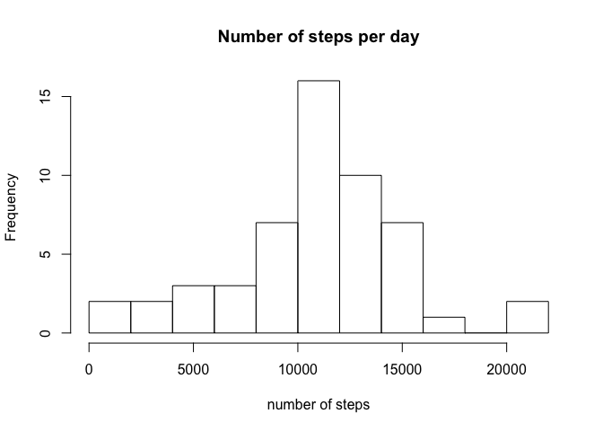
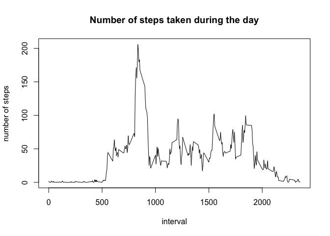
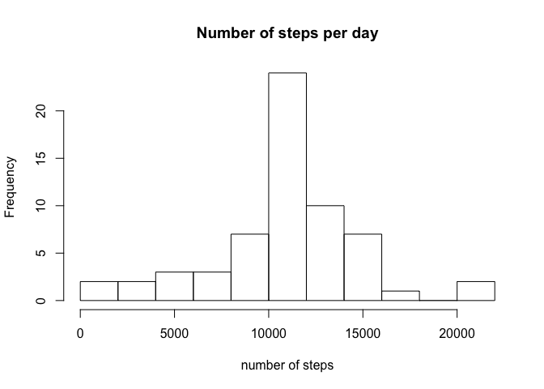
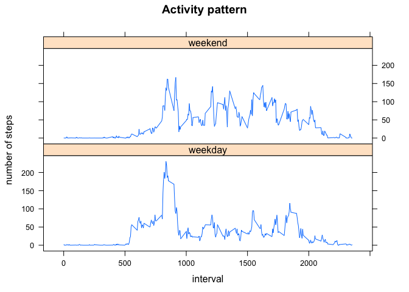

# Reproducible Research: Peer Assessment 1

In this project, we analyze data from a personal activity monitoring device.
The data set contains the number of steps taken in 5 minute intervals each day from October to November, 2012.


## Loading and preprocessing the data
Since the data is stored as a `csv` file, this part is really straightforward

```r
if (!file.exists("activity.csv")) unzip("activity.zip")   # unzip if necessary 
df <- read.csv("activity.csv")                            # read the data
```

The data frame `df` contains 17568 observations of  3 variables

```r
str(df)
```

```
## 'data.frame':	17568 obs. of  3 variables:
##  $ steps   : int  NA NA NA NA NA NA NA NA NA NA ...
##  $ date    : Factor w/ 61 levels "2012-10-01","2012-10-02",..: 1 1 1 1 1 1 1 1 1 1 ...
##  $ interval: int  0 5 10 15 20 25 30 35 40 45 ...
```
* **steps:** Number of steps taking in a 5-minute interval (missing values are
coded as NA)
* **date:** The date on which the measurement was taken in YYYY-MM-DD
format
* **interval:** Identifier for the 5-minute interval in which measurement was
taken

No data preprocessing is needed at this point.


## What is mean total number of steps taken per day?

For this part of the assignment, we will use the `dplyr` package, which allows to group the data by day and summarize it by computing the sum of steps for each day

```r
library(dplyr)
perDay <- df %>% group_by(date) %>% summarise(totSteps = sum(steps))
```
We see that the total number of steps per day is (very roughly) normally distributed

```r
hist(perDay$totSteps, breaks = 15, main = "Number of steps per day", xlab = "number of steps")
```

<!-- -->

with the mean value of

```r
mean(perDay$totSteps, na.rm = TRUE)
```

```
## [1] 10766.19
```
and the median of

```r
median(perDay$totSteps, na.rm = TRUE)
```

```
## [1] 10765
```
Note that in this part of the assignment we ignored missing values in the data.
The results would differ, if we removed `NAs`.


## What is the average daily activity pattern?

To answer this question, we will group the data by 5-minute intervals and summarize by averaging across all days.
Once again, we ignore `NAs`

```r
perInterval <- df %>% group_by(interval) %>% summarise(avgSteps = mean(steps, na.rm = TRUE))
with(perInterval, plot(interval, avgSteps, type = "l", ylab = "number of steps",
                       main = "Number of steps taken during the day"))
```

<!-- -->

On average, the maximum of activity, with 206 steps per a 5-minute interval, occurs between 8:35 and 8:40 AM

```r
perInterval[which.max(perInterval$avgSteps), ]
```

```
## # A tibble: 1 x 2
##   interval avgSteps
##      <int>    <dbl>
## 1      835 206.1698
```


## Imputing missing values

The original data set contains 2304 rows with missing values

```r
sum(is.na(df$steps))
```

```
## [1] 2304
```

To avoid bias caused by these `NAs` we will replace each missing value by the mean number of steps in the corresponding 5-minute interval

```r
newdf <- df %>% group_by(interval) %>% mutate(steps = ifelse(is.na(steps), as.integer(mean(steps, na.rm = TRUE)), steps))
```

Now we can simply repeat our analysis in the first part

```r
perDay <- newdf %>% group_by(date) %>% summarise(totSteps = sum(steps))
hist(perDay$totSteps, breaks = 15, main = "Number of steps per day", xlab = "number of steps")
```

<!-- -->

The histogram looks very similar to the one with `NAs`.
The mean 

```r
mean(perDay$totSteps, na.rm = TRUE)
```

```
## [1] 10749.77
```
and the median values, however,

```r
median(perDay$totSteps, na.rm = TRUE)
```

```
## [1] 10641
```
differ from those reported above.


## Are there differences in activity patterns between weekdays and weekends?

Let us start by creating a column of day names using the `weekdays()` function.

```r
newdf$day <- weekdays(as.POSIXct(newdf$date, format = "%Y-%m-%d"))
```

Then we convert day names into day types (weekend or weekday)

```r
newdf$day <- ifelse(newdf$day == "Saturday" | newdf$day == "Sunday", "weekend", "weekday")
```

Now we can group the data by both date and interval, and summarize by averaging across weekdays and weekends

```r
perDay <- newdf %>% group_by(day, interval) %>% summarise(avgSteps = mean(steps))
```

Finally, we plot the activity patterns with the `lattice` package

```r
library(lattice)
xyplot(avgSteps ~ interval | day, data = perDay, type = "l", layout = c(1, 2),
       main = "Activity pattern", ylab = "number of steps")
```

<!-- -->
